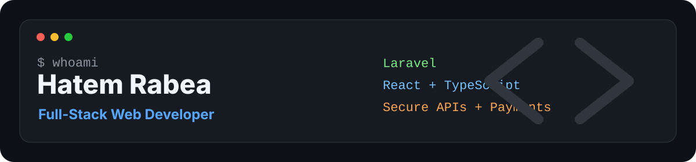

<p align="center">
  
</p>

<h1 align="center">Hi, I'm Hatem Rabea</h1>

<p align="center">
  <strong>Full-Stack Web Developer</strong>
  <br />
  Laravel · React · TypeScript · Payments · SaaS · Localization
</p>

<p align="center">
  <a href="https://www.linkedin.com/in/hatimrabea">
    
  </a>
  <a href="https://github.com/HatemRabeaHamde">
    
  </a>
  <a href="mailto:xavio1115@gmail.com">
    
  </a>
  <a href="https://wa.me/201101980053">
    
  </a>
</p>

---

## A Little Bit About Me

```yaml
name: Hatem Rabea
located_in: Cairo, Egypt
current_role: Full-Stack Web Developer
experience: 3+ years

specialized_in:
  [
    "Laravel APIs",
    "React applications",
    "Payment systems",
    "Booking workflows",
    "Admin dashboards",
    "Arabic/English localization",
  ]

markets_served: ["KSA", "UAE", "Egypt", "Europe"]

engineering_style:
  [
    "Clean architecture",
    "Service layer",
    "Repository pattern",
    "Secure payment flows",
    "Performance-focused APIs",
  ]

availability:
  "Open to remote full-stack roles, freelance projects, and production SaaS work"
```

---

## Snapshot

| 10+ | 8+ | Up to 55% | 3+ |
|---:|---:|---:|---:|
| Production platforms | Payment gateways | Performance gains | Years experience |

---

## Tools I Use

<p>
  
  
  
  
  
  
  
  
  
  
  
  
  
  
  
</p>

`SOLID` `Service Layer` `Repository Pattern` `Clean Architecture` `REST APIs` `Webhooks` `RTL/LTR`

---

## Selected Work

**[aiSmarty](./case-studies/aismarty.md)** — AI · SaaS  
Shopify content optimization · OAuth · product sync · AI workflows · one-click publish  
💡 Learned: long-running AI jobs with background polling & queues

**[Saedni](./case-studies/saedni.md)** — Payments  
Automotive platform · subscriptions · MyFatoorah · Firebase · RTL/LTR  
💡 Learned: reliable subscription billing with webhook verification

**[Machine Rental](./case-studies/machine-rental.md)** — Marketplace  
Heavy-machine rental · OTP login · booking lifecycle · role-based access · admin reporting  
💡 Learned: modeling complex booking state machines cleanly

**[Real Estate Platform](./case-studies/real-estate-platform.md)** — Multi-vendor  
Contracts · invoices · PDF generation · localization · performance optimization  
💡 Learned: server-side PDF generation & query optimization under load

**[WestClean](./case-studies/westclean.md)** — Payments  
Laundry marketplace · OTP · Moyasar · role-scoped APIs · AR/EN localization  
💡 Learned: scoping APIs per role & securing payment callbacks

---

## How I Build

- Keep business logic inside services, away from controllers and UI components.
- Design APIs with validation, authorization, predictable responses, and secure payment flows.
- Treat webhooks with verification, idempotency, and duplicate protection.
- Optimize slow database paths using eager loading, caching, and query tuning.
- Build Arabic/English products with RTL/LTR support from the start.

---

## Contact

| Channel | Link |
|---|---|
| LinkedIn | [linkedin.com/in/hatimrabea](https://www.linkedin.com/in/hatimrabea) |
| GitHub | [github.com/HatemRabeaHamde](https://github.com/HatemRabeaHamde) |
| Email | [xavio1115@gmail.com](mailto:xavio1115@gmail.com) |
| Phone | [+20 110 198 0053](tel:+201101980053) |
| WhatsApp | [wa.me/201101980053](https://wa.me/201101980053) |

---

<p align="center">
  <strong>Clean architecture. Secure APIs. Scalable platforms.</strong>
</p>
