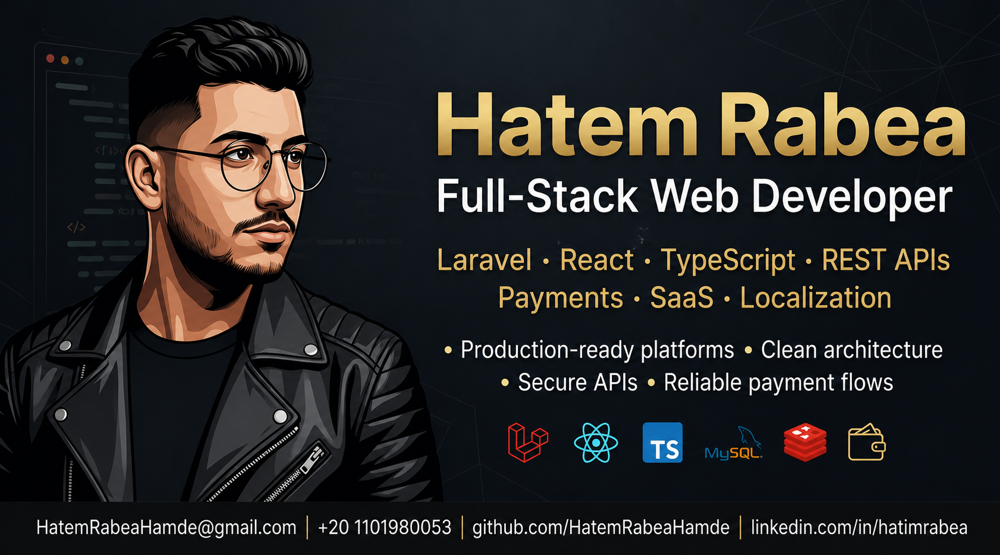

  

## 👨‍💻 About Me

I build production-ready platforms focused on scalability, maintainability, and business growth.

Over the past few years, I've worked on SaaS products, booking systems, marketplaces, subscription platforms, payment integrations, and multilingual applications serving clients across the Middle East and Europe.

My focus is simple:

Build clean systems
Ship reliable features
Scale without chaos

## 🚀 Core Expertise

* SaaS Platforms
* Marketplace Development
* Payment Integrations
* API Design & Security
* System Architecture
* Performance Optimization
---

## 🌟 Featured Projects

### 🤖 AI Smarty
Multi-tenant Shopify SaaS platform for AI-powered content generation and publishing.

**Tech:** React 19 · RTK Query · Tailwind CSS · Shopify API

🔗 Case Study: [View Details](./case-studies/ai-smarty.md)

---

### 💳 Saedni
Automotive subscriptions and payment platform with subscription billing and payment integrations.

**Tech:** Laravel · React · MyFatoorah · Firebase

🔗 Case Study: [View Details](./case-studies/saedni.md)

---

### 🏗️ Machine Rental Marketplace
Heavy equipment booking and management marketplace.

**Tech:** Laravel · OTP Authentication · RBAC

🔗 Case Study: [View Details](./case-studies/machine-rental.md)

---

### 🏠 Real Estate Platform
Multi-vendor property management platform.

**Tech:** Laravel · Invoices · PDF Generation · Localization

🔗 Case Study: [View Details](./case-studies/real-estate.md)

---

### 🧺 WestClean
Laundry marketplace with integrated payment processing.

**Tech:** Laravel · Moyasar · REST APIs

🔗 Case Study: [View Details](./case-studies/westclean.md)

---
## ⚡ Tech Stack

### Backend

`Laravel` `PHP` `REST APIs` `Sanctum` `Redis` `Meilisearch` `Queues & Jobs`

### Frontend

`React` `TypeScript` `Redux Toolkit` `RTK Query` `Tailwind CSS` `Vite`

### Architecture & Engineering

`SOLID` `Repository Pattern` `Service Layer`
`DTOs` `Clean Architecture`
`PHPUnit` `Pest` `GitHub Actions`

### DevOps

`Docker` `Linux`
`Nginx` `CI/CD`
`VPS Deployment`

### Integrations

`Payment Gateways`
`Firebase FCM`
`OTP/SMS Services`
`Third-Party APIs`
`Webhook Handling`

---

## 📫 Contact

  
  
  
  

---

  <strong>Building Scalable SaaS Products • Clean Architecture • Secure APIs</strong>

